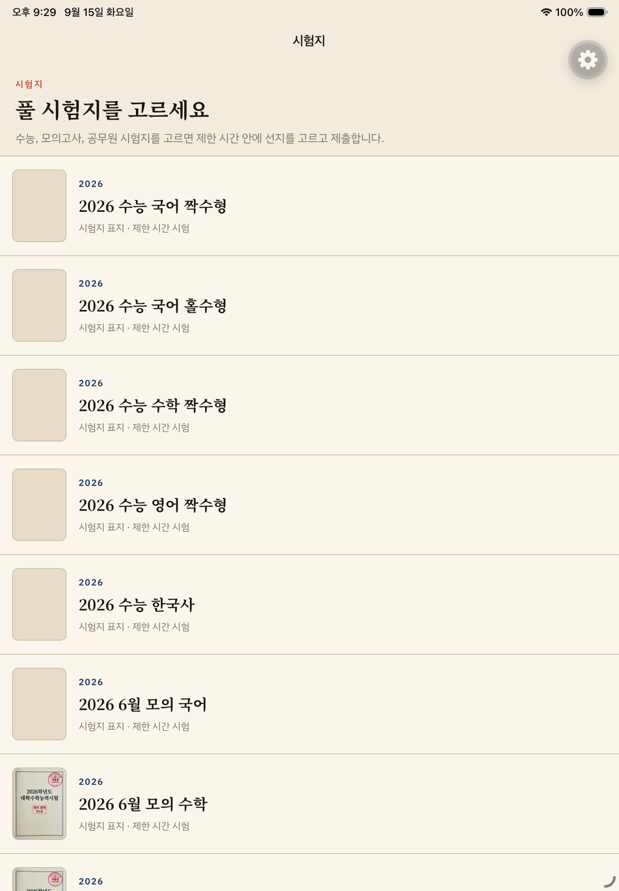
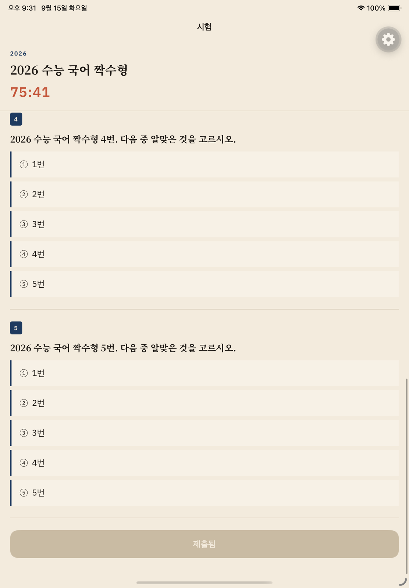

# SheetKeep

시험지를 고르고 제한 시간 안에 푼다. 수능, 모의고사, 공무원 시험지를 골라 선지를 고르고 제출한다. 제출 전에 앱을 꺼도 같은 시험, 같은 답, 남은 시간이 돌아온다.

Expo SDK 57, React Native 0.86, SQLite, New Architecture. 개발 클라이언트 빌드가 필요하다.

## 화면

시험지 목록.



시간 안에 푸는 시험 세션.



## 왜 이렇게 만들었나

시험지가 많거나, 페이지에 같은 id가 반복되거나, 시험 중에 프로세스가 죽으면 목록과 세션이 깨진다. 기본 실행은 서로 다른 시험지 20장이다. 200장, 중복 페이지, 큰 표지는 테스트에만 넣는다.

| 문제 | 흔한 방식 | SheetKeep |
| --- | --- | --- |
| 전화 후 타이머가 리셋됨 | 메모리 elapsed | SQLite `deadlineAt` 벽시계 |
| 복원 중 빈 시험이 답을 덮음 | 화면이 뜨자마자 기록 | `restoring`이면 `onChoice` 차단 |
| 목록이 모든 행을 마운트 | 윈도우 없는 `ScrollView` / `FlatList` | LegendList `recycleItems`, 키 `examId` |
| 중복 id 페이지에서 목록이 멈춤 | 길이가 안 늘면 끝으로 처리 | 본 id는 건너뛰고 다음 페이지 (예산 5) |
| 화면 밖 표지까지 decode | 행마다 이미지 항상 로드 | 보이는 행만 decode |
| 스크롤 중 카드가 눌림 | 부모 스크롤이 탭을 먹음 | 카드 탭 slop |

## 하는 일

- 기본 시험지 20장. `2026 수능 국어 짝수형`, `6월 모의`, `공무원 한국사` 포함
- 남은 시간, 선지, 제출
- 같은 설치, 같은 `examId`로 답과 초안 복원
- 보이는 카드만 살린다. LegendList 데모가 아니다
- iOS/Android New Architecture
- 시험지 제목·표지 카피는 EAS Update로 같은 바이너리에 올린다

## 실행

> [!IMPORTANT]
> Expo Go가 아니다. `expo-sqlite`와 `react-native-unistyles`는 개발 빌드가 필요하다.

```bash
npm install
npm test
npx eas build --profile development --platform ios
npx expo start --dev-client
```

## 화면 흐름

목록에서 카드를 누르면 세션이 시작된다. 세션은 SQLite에 저장되고, 복원 중에는 선지를 받지 않는다.

`src/app`은 Expo Router. 화면은 `src/screens/sheet-list-screen.tsx`, `session-screen.tsx`. 저장은 `src/features/session`, 목록은 `src/features/list`.

## 태블릿 런타임

`ios.supportsTablet`이 켜져 있다. `eas.json` 채널은 `development` / `preview` / `production` (`@cyjoon/sheetkeep`).

시험지 제목만 고친 뒤:

```bash
npx eas update --channel production --message "시험지 제목 수정"
```

네이티브 변경은 `eas build`가 필요하다.

## 요구 사항

- Node.js 20+
- Expo SDK 57 / React Native 0.86
- iOS 또는 Android 시뮬레이터
- 클라우드 빌드는 EAS 계정
